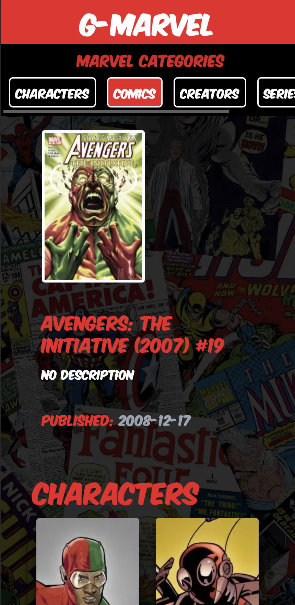
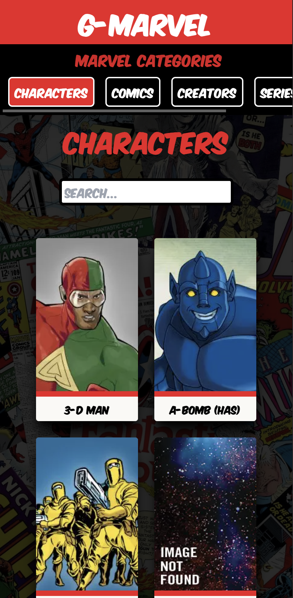

# G-Marvel App

**[LIVE DEMO](https://marvel-app-beta-ruddy.vercel.app)**

 

# Description

G-Marvel is a project that utilizes the Marvel API to fetch and display information about Marvel comics, characters, and more.

 

# Tools

- JavaScript
- TypeScript
- React
- NextJs
- Tailwind CSS

 

# packages

- crypto-js
- use-debounce
- clsx

 

# Developer

**Gorgees Odisho**

- [LinkedIn](https://www.linkedin.com/in/gorgees/)

 

---

    
    

    
    
    
    

